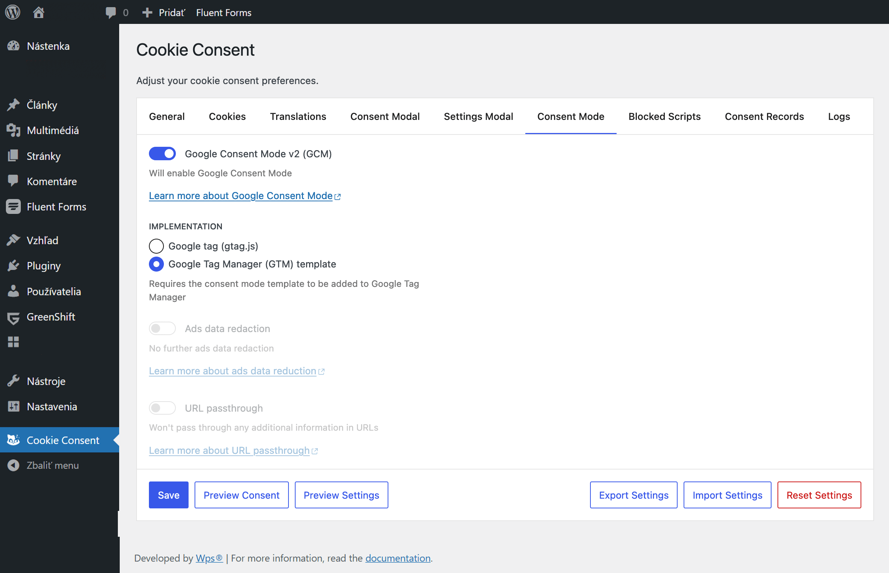
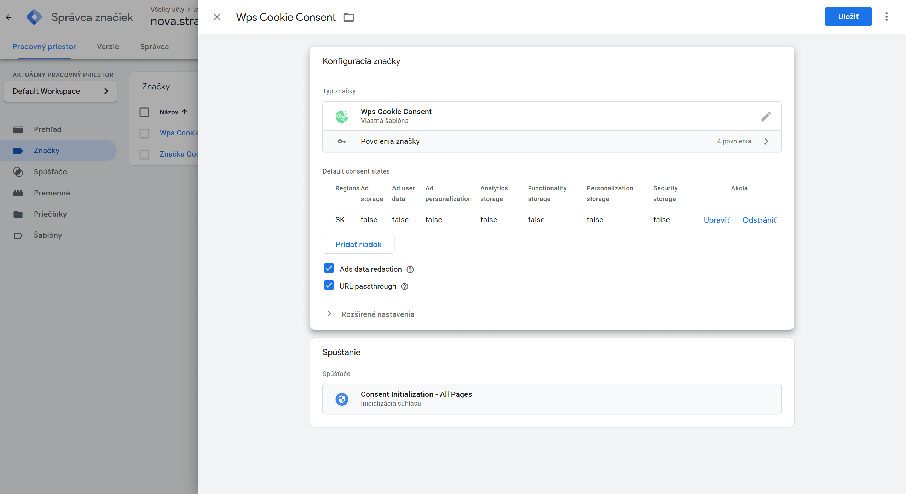
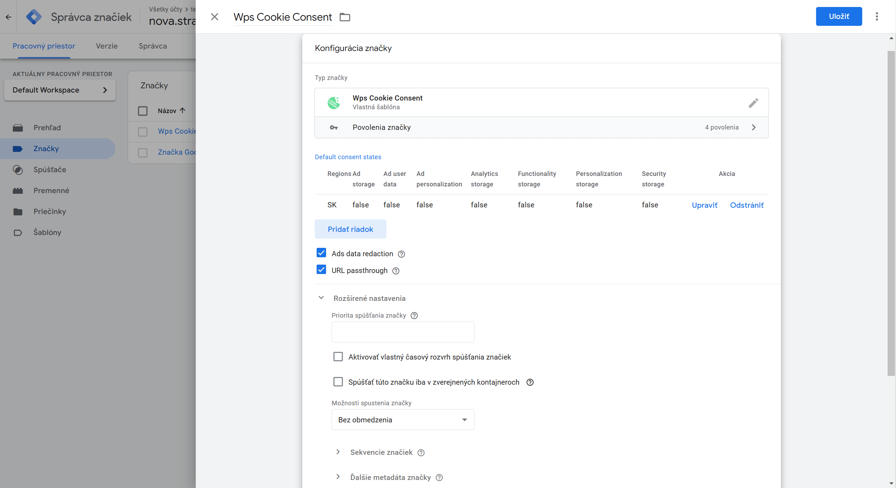

    

# Wps Cookie Consent GTM Template

Google Tag Manager consent šablóna pre 
[Wps Cookie Consent](https://github.com/drimlon/wps-cookie-consent/) WordPress plugin.

## Table of Contents

* [Nastavenie](#setup)
  * [Inštalácia pluginu Wps Cookie Consent](#install-the-wps-cookie-consent-plugin)
  * [ Konfigurácia Google Consent Mode (GCM)](#configure-google-consent-mode-gcm)
  * [Inštalácia GTM šablóny](#install-the-gtm-template)
  * [Konfigurácia GTM značky](#configure-the-gtm-tag)
* [Vlastnosti](#Vlastnosti)
* [Chyby a Vlastnosti](#bugs--Vlastnosti)
* [License](#License)

## Nastavenie

Na svoju stránku WordPress je potrebné nainštalovať doplnok Wps Cookie Consent
a nakonfigurujte ho tak, aby fungoval so šablónou GTM.

### Inštalácia pluginu Wps Cookie Consent

Začnime inštaláciou
[Wps Cookie Consent](https://github.com/drimlon/wps-cookie-consent/) WordPress pluginu:

1. Prihláste sa do svojho informačného panela WordPress
2. Prejdite do ponuky „Pluginy“.
3. Vyberte "Pridať nový" následne na "Nahrať plugin"
4. Kliknite na „Inštalovať teraz“ a WordPress to odtiaľ prevezme
5. Aktivujte plugin cez menu “Pluginy” na WordPress

Prípadne si ho môžete stiahnuť ručne z jeho
[GitHub repository](https://github.com/drimlon/wps-cookie-consent).

###  Konfigurácia Google Consent Mode (GCM)

1. Prejdite do ponuky „Cookie Consent“.
2. Na karte „Režim súhlasu“ povoľte „Režim súhlasu Google v2 (GCM)“
3. Ako možnosť Implementácia vyberte možnosť „Šablóna Správcu značiek Google (GTM)“.
4. Kliknite na „Uložiť“

### Inštalácia GTM šablóny

1. Prejdite do [galérie komunitných šablón](https://tagmanager.google.com/gallery/)
2. Vyhľadajte „Wps Cookie Consent“
3. Vyberte šablónu a kliknite na „Pridať do pracovného priestoru“
4. Vyberte pracovný priestor, do ktorého chcete pridať šablónu, a kliknite na tlačidlo „Pridať“
5. Opätovným kliknutím na „Pridať“ potvrďte
6. Kliknutím na „Odoslať“ uložíte zmeny

### Konfigurácia GTM značky

1. Prejdite do [Správca značiek Google](https://tagmanager.google.com/)
2. Vyberte pracovný priestor, do ktorého ste pridali šablónu
3. Prejdite do ponuky „Značky“.
4. Kliknutím na „Nový“ vytvoríte novú značku
5. V časti Konfigurácia značky kliknite na položku Vybrať typ značky na začatie nastavovania.
6. Vyberte šablónu „Wps Cookie Consent“.
7. Nakonfigurujte značku podľa potreby
8. V sekcii Spúšťanie kliknite na položku Vybrať spúšťač na spustenie tejto značky.
9. Vyberte „Inicializácia súhlasu – všetky stránky“
10. Kliknutím na „Nový“ vytvoríte nový spúšťač
11. Kliknite na „Uložiť“
12. Kliknutím na „Odoslať“ uložíte zmeny

V časti „Konfigurácia značky“ môžete nakonfigurovať nasledujúce nastavenia:

* Predvolené stavy súhlasu
* Redakcia údajov o reklamách
* Prechod adresy URL

V časti Predvolené stavy súhlasu kliknite na položku Pridať riadok a pridajte nový riadok pre každý región. Pre každý riadok môžete nastaviť
regióny ako zoznam kódov [ISO 3166-2](https://en.wikipedia.org/wiki/ISO_3166-2) oddelených čiarkami (nechajte prázdne
aby sa váš výber vzťahoval na všetky regióny) a predvolený stav súhlasu pre každý typ súhlasu.

| Region      | Správanie                                  |
|-------------|--------------------------------------------|
| `SK`        | Aplikuje sa pre Slovensko                  |
| Unspecified | Aplikuje sa pre všetky regióny             |

## Vlastnosti

### Predvolené stavy súhlasu pre konkrétny región

Šablóna vám umožňuje nastaviť rôzne predvolené stavy súhlasu pre rôzne regióny. To je užitočné, ak potrebujete
dodržiavať rôzne zákony na ochranu súkromia v rôznych regiónoch.

Pre každý typ súhlasu môžete nastaviť predvolený stav súhlasu:

* Ad storage
* Ad user data
* Ad personalization
* Analytics storage
* Functionality storage
* Personalization storage
* Security storage

pre akýkoľvek región zadaním jeho [ISO 3166-2](https://en.wikipedia.org/wiki/ISO_3166-2) kódu.

### Úprava údajov o reklamách

Keď je typ súhlasu „Ukladací priestor reklám“ zamietnutý, odošlú sa identifikátory kliknutí na reklamu
sieťové požiadavky zo služieb Google Ads a Floodlight budú redigované. Prostredníctvom sa budú odosielať aj požiadavky siete
doména bez cookies

### URL passthrough

Prejde cez informácie o kliknutí na reklamu, ID klienta a ID relácie vo webových adresách.

## Chyby a Vlastnosti

Ak ste si všimli nejaké chyby šablóny, prosím
[open an issue](https://github.com/drimlon/wps-cookie-consent-gtm-template/issues).

## License

Apache License 2.0, skontrolujte súbor [`License`](./License).
